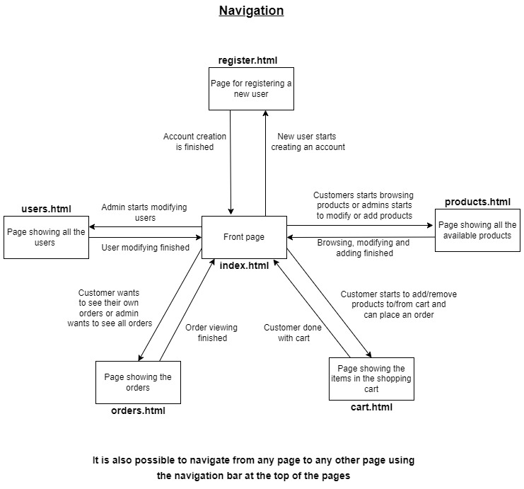

# Group 16

Member1:  Max Gratschew, max.gratschew@tuni.fi, H283272, 
resposible for: Models, Backend (Api methods for products) frontend (orders and product layout (css and image handling)), CI pipeline, app deployment

Member2:  Simo Selinummi, simo.selinummi@tuni.fi, H283237, 
resposible for: Backend (API methods and request handling in general), frontend (products and cart), tests, accessibility


# WebDev1 coursework assignment

A web shop with vanilla HTML, CSS. 

### Initial project plan

Our initial project plan was to:
-     1. first implement the model for orders
-     2. Implement the necessary backend API methods and handling for products and orders
-     3. Implement the UI for orders and implement products' image handling
-     4. Finish the project by fixing the issues that came up from all the tests and graders (SonarQube and accessibility from optional graders)
-     5. Tets the finished app's UI manually to spot possible issues and fix em

These tasks were split into issues and both of our group members participated somehow in each step to learn something from each field.

### The project structure

```
.
├── index.js                --> starting points of the backend server
├── package.json            --> holds metadata and dependencies relevant to the project
├── routes.js               --> router that handles what happens after a request
├── auth                    --> authentication
│   └──  auth.js            --> handles the authentication of a user
├── controllers             --> controllers separated to simplify routes.js
│   ├── orders.js           --> controller for orders
│   ├── products.js         --> controller for products
│   └── users.js            --> controller for user
├── models                  --> data models
│   ├── db.js               --> model for the database
│   ├── order.js            --> model for an order; attributes: customerId(String), items(Array);
│   │                           --> items(Array).items --> orderedItemSchema: schema for an ordered item and it's quantity; attributes: 
│   │                               product(productSchema), quantity(number)    
│   │                                   --> product(productSchema): schema for products; attributes: _id(string), name(string), price(number), 
│   │                                       descrption(string)
│   │                           connections to database, product (uses product's _id) and user models (uses customerId)
│   ├── product.js          --> model for a product; attributes: name(String), price(Number), image(String),
│   │                           description(String); connection to database model
│   └── user.js             --> model for a user; attributes: name(String), email(String), password(String),
│                               role(String); connection to database model 
├── public                  --> UI handling
│   ├── 404.html            --> html file for error page
│   ├── index.html          --> html file for main page
│   ├── cart.html           --> html file for cart page
│   ├── orders.html         --> html file for order page
│   ├── products.html       --> html file for products page
│   ├── register.html       --> html file for register page
│   ├── users.html          --> html file for users page 
│   ├── js                  --> connects the UI to the server
│       ├── adminusers.js   --> handles the users page
│       ├── cart.js         --> handles the cart page
│       ├── orders.js       --> handles the orders page   
│       ├── products.js     --> handles the products page
│       ├── register.js     --> handles the register page
│       ├── utils.js        --> gives helper functions for handling in public/js files          
│   └── css                 --> styles the UI
├── utils                   --> provides helper functions for other modules
│   ├── render.js           --> responsible for serving files from "public/"
│   ├── requestUtils.js     --> functions for handling requests
│   └── responseUtils.js    --> functions for handling responses
└── test                    --> tests
│   ├── auth                --> tests for authentication
│   ├── controllers         --> tests for controllers
└── └── own                 --> own tests that were created


```


- **package.json** holds all the dependencies and important scripts related to project's testing and quality (coverage, nodemon, database setup, eslint, fp-lint, jsdoc-lint, tests).

- **adminusers.js** Makes API call to display users on users.html if admin credentials are logged in.

- **cart.js** Sends API call to create a new order to the database if customer credentials are logged in. 

- **orders.js** Makes API call to display orders on orders.html. If a customer is logged in, displays all customer's order. If admin is logged in, displays all orders in the system. 

- **products.js** Makes api call to fetch all products from the database and displays them on products.html. If admin credentials are logged in, modifying and creating new products is allowed and needed UI elements are enabled. 

## The architecture 

Projects system is based on REST architecture. Server provides access to database's resources
and the system's user can access and modify these resources using HTTP protocol. The system also
follows MVC pattern. This means that the application is divided in to three parts which are model,
view and controller. The main goal of using this pattern is to separate functionality, logic, and the interface of this app to promote organized programming. This also enabled a better possibility for two people to work on the same project simultaneously.

**Model**

MongoDB is used as the database and determines how a database is structured. Mongoose is used as an Object Data Modeling library to translate between objects in code and the representation of those objects in MongoDB.

**View** 

The view is where the users interact within the application. Html files located in public/ by the aid of corresponding .js files create our app's view. 

**Controller**

The controller interacts with the model and serves the response and functionality to the view by the aid of response utils. When an user makes a request from the view, it’s sent to the API, routes.js, which handles the request and interacts with the database.

## Tests and documentation

TODO: Links to at least 10 of your group's GitLab issues, and their associated Mocha tests and test files.
Gitlab issues:
- https://course-gitlab.tuni.fi/webdev1-autumn-2021/webdev1-group16/-/issues/1
- https://course-gitlab.tuni.fi/webdev1-autumn-2021/webdev1-group16/-/issues/2
- https://course-gitlab.tuni.fi/webdev1-autumn-2021/webdev1-group16/-/issues/3
- https://course-gitlab.tuni.fi/webdev1-autumn-2021/webdev1-group16/-/issues/4
- https://course-gitlab.tuni.fi/webdev1-autumn-2021/webdev1-group16/-/issues/5
- https://course-gitlab.tuni.fi/webdev1-autumn-2021/webdev1-group16/-/issues/6
- https://course-gitlab.tuni.fi/webdev1-autumn-2021/webdev1-group16/-/issues/7
- https://course-gitlab.tuni.fi/webdev1-autumn-2021/webdev1-group16/-/issues/8
- https://course-gitlab.tuni.fi/webdev1-autumn-2021/webdev1-group16/-/issues/9
- https://course-gitlab.tuni.fi/webdev1-autumn-2021/webdev1-group16/-/issues/10

Created tests:
- [Corresponding tests](/test/own/own_users.test.js)


## Security concerns

TODO: list the security threats represented in the course slides.
Document how your application protects against the threats.
You are also free to add more security threats + protection here, if you will.

**Threats**:
- XSS, **protection**: CORS
- User input, protection: User input being validated 
- Session hijacking
- Session fixation
- Session sidejacking
- CSRF
- Injection attacks
- Directory traversal
- Database hacking, **protection**: Passwords are stored after hashing and salting (bcrypt)

## Navigation



## Running the application

### Heroku
The application can be tested directly on [Heroku Group 16](https://g16webdev.herokuapp.com/)! The default users are the same as in [users.json](setup/users.json), **Username** would be the email adress in the email field and **password** would be the password field. **Admin** users are those, which role-field is set to "admin". 

### Locally
The application can be run locally by 
- 1. pulling the project
- 2. turning MongoDB server on
- 3. typing npm install on the commandshell inside the project
- 4. typing npm run reset-db
- 5. typing npm nodemon
